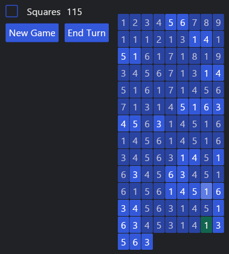

# crossout
Digitised version of a paper&pen game from my childhood,
to learn rust GUIs.

Still searching for a better name...

### Rules:
- The goal is to cross out all numbers
- You can cross of a pair of numbers if they are adjecent (vertically or horizontally **and** match or add up to 10
- Adjency ignores already used numbers and wraps around on the right side to the left of the row below
- The absolute first and last also count as adjecent
- If no more pairs can be found, press "End Turn" to add all remaing numbers again
#

 
